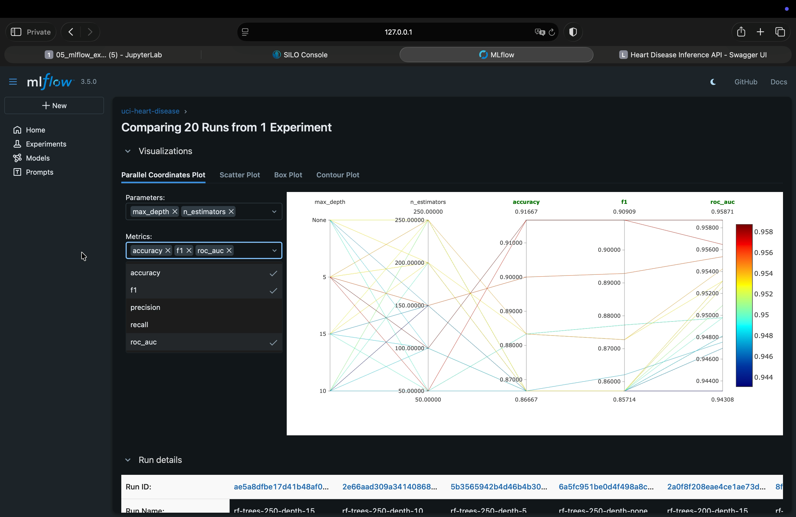

# Assignment 4

Run commands from `assignment4`.

## Start services

```bash
docker compose up -d
docker compose ps
```

## Open

- JupyterLab: http://localhost:8888 — token: `mlops2026`
- MLflow: http://localhost:5000
- MinIO console: http://localhost:9001 — user: `s3admin`, password: `s3admin123`
- Inference API docs: http://localhost:8000/docs

If localhost does not work, try 127.0.0.1 or replace it with the machine’s IP address.

## Test API

```bash
curl http://localhost:8000/health
```

The prediction API uses the MLflow alias `champion`. Run notebook `05_mlflow_experiment.ipynb`
through its final registration cell and wait for `Champion alias verified` before calling
`/health` or `/predict`. A message like `Registered model ... already exists. Creating a new
version...` is informational: registration is still in progress. If the notebook reports a
registration timeout or failed status, inspect the service logs from this directory:

```bash
docker compose logs --tail=200 mlflow storage
```

Once the alias is set, check the API with `curl http://localhost:8000/health`
before sending a prediction.

Notebook 5 registers the selected model using its actual artifact location and run ID.
This avoids an MLflow 3.5 registry lookup that can fail with
`Read-only file system: './mlruns'` and repeated `500` responses from
`/api/2.0/mlflow/model-versions/create`. Each execution of the final cell creates a
model version and assigns `champion` to it. This does not require retraining.

```bash
curl -X POST http://localhost:8000/predict \
  -H 'Content-Type: application/json' \
  -d '{"instances":[{"age":63,"sex":1,"cp":1,"trestbps":145,"chol":233,"fbs":1,"restecg":2,"thalach":150,"exang":0,"oldpeak":2.3,"slope":3,"ca":0,"thal":6}]}'
```

The response gives one prediction per input row, in the same order. The prediction is
written in plain language, and each probability is labeled and expressed as a percentage:

```json
{
  "predictions": [
    {
      "prediction": "No heart disease predicted",
      "probabilities_percent": {
        "no_heart_disease": 73.81,
        "heart_disease": 26.19
      }
    }
  ]
}
```

The training target maps `0` to no heart disease and `1` to heart disease present.

## Video demo

[](https://drive.google.com/file/d/1Rf4WNv328yIbfRgqGWJFz16FwPt615Pf/view?usp=share_link)

Click the image to watch the video.

## Stop services

```bash
docker compose down
```


## Delete all Docker containers, images and volumes

These commands remove Docker resources across the whole machine:

```bash
docker ps -aq | xargs -r docker rm -f
docker images -q | sort -u | xargs -r docker rmi -f
docker volume ls -q | xargs -r docker volume rm -f
```
