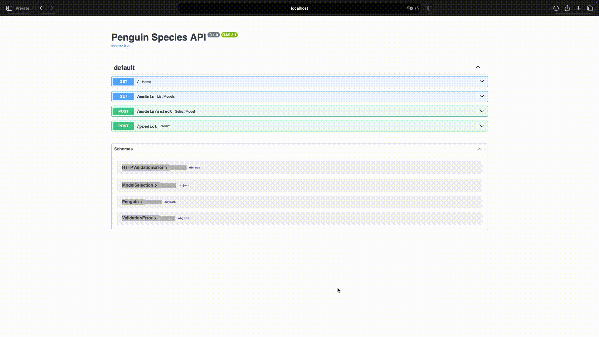

# Assignment 1

Run all commands in this README from the `assignment_1` directory.

## Data

```bash
curl -L --retry 3 -o data/penguins.csv https://cdn.jsdelivr.net/gh/mwaskom/seaborn-data@master/penguins.csv
```

## Environment

If this assignment already contains `pyproject.toml` and `uv.lock`, run:

```bash
uv sync
```

To create the project files from an empty Assignment 1 folder, run once:

```bash
uv init --bare --name penguin-api
uv python pin 3.14
uv add PACKAGE_NAME
uv sync
```

`uv sync` creates `.venv` automatically. Do not use `pip install` for this project.

## Python

```bash
uv run train.py
uv run inference.py
```

## API

```bash
uv run uvicorn api:app --host 0.0.0.0 --port 8989
```

```text
http://localhost:8989/docs
```

## Docker

```bash
docker build -t penguin-api .
docker images
docker run --rm -p 8989:8989 penguin-api
docker ps -a

docker rmi IMAGE_ID
```

## Demo


